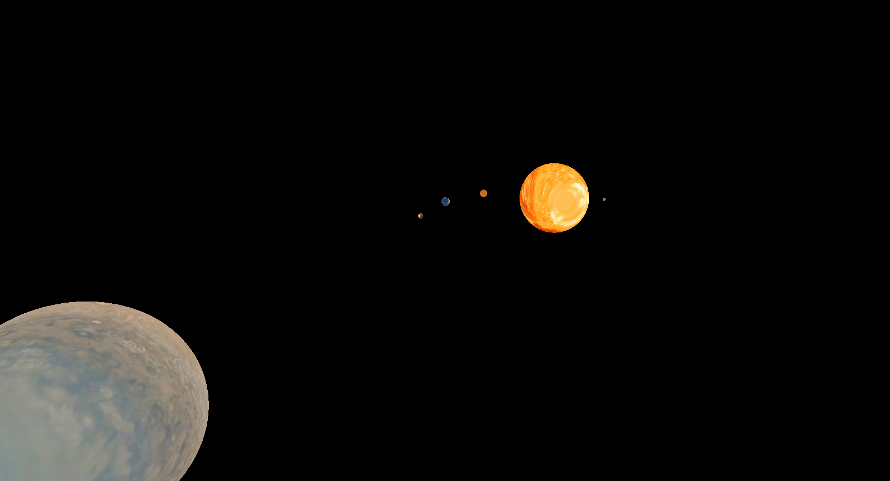

##### Управление
wasd - перемещение
ctrl - увеличить скорость
зажатая мышка - поворот камеры

##### Сборка
* Для сборки необходимы:
    * cmake 3.13 и выше
    * conan (`pip3 install conan`)

___Игру необходимо запускать из корня проекта(из одной папки с файлом `parameters.json`) чтобы она смогла найти шейдеры, текстуры и параметры.___

* Linux
    * `./releaseBuild.sh` -> в папке `./build/bin` появится исполняемый фаил `Game`

* Windows (Это способ, который сработал у меня, возможно visual studio и сама справится с выполнением cmake)
    * В `git bash` запустить `./releaseBuild.sh`. 
    * Он провалится, но сгенерирует фаил `.sln` в папку `build`. 
    * Запустить этот фаил с помощью visual studio и собрать цель game
    * В `./build/bin` должен появиться `Game.exe`

* Mac
    * Not yet

